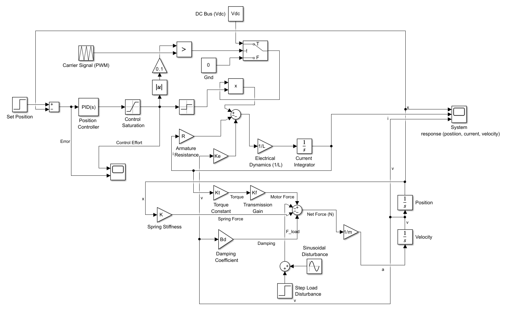
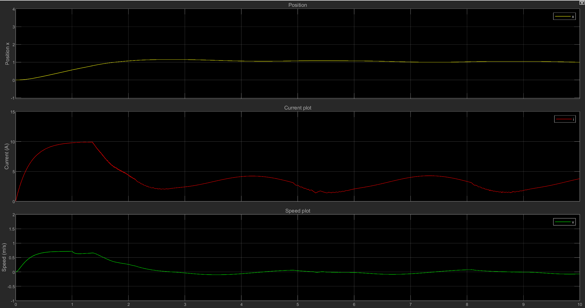
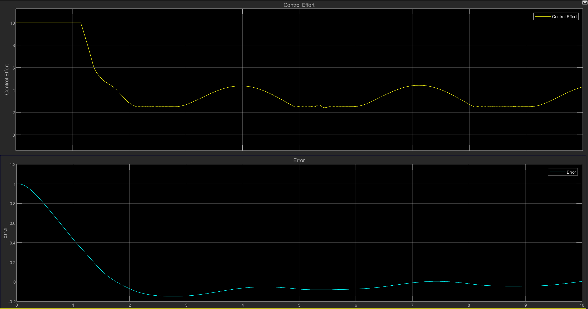

# Power Electronic Drive System for Aircraft Electromechanical Actuator (EMA)
##  Overview

This project presents a complete system-level simulation of an Aircraft Electromechanical Actuator (EMA) developed using MATLAB and Simulink.

The model integrates electrical, mechanical, and control subsystems to replicate realistic actuator behavior used in modern aircraft systems such as flight control surfaces.

Unlike simplified motor models, this project captures the full chain from power electronics to mechanical motion, including disturbance handling and system dynamics.

---

## System Architecture

The EMA system is modeled as a closed-loop control system consisting of:

* **PWM-based H-Bridge Power Electronic Drive**
* **DC Motor Electrical Dynamics (R-L model with Back EMF)**
* **Torque Generation and Transmission (Gear + Lead Screw)**
* **Mechanical Load (Mass-Spring-Damper System)**
* **PID Position Controller**
* **External Disturbances (Step + Sinusoidal Loads)**

### Model Block Diagram



---

## Working Principle

1. A desired position is provided as input.
2. The PID controller generates a control signal based on error.
3. PWM converts this into switching signals for the H-bridge.
4. The motor produces torque proportional to current.
5. Torque is converted into force via transmission.
6. The mechanical system responds according to mass, damping, and stiffness.
7. The resulting position is fed back to close the loop.

---

## Simulation Results

### System Response (Position, Current, Velocity)



### Error and Control Effort



---

## Disturbance Handling

The system is tested under:

* **Step Load Disturbance**
* **Sinusoidal Load Disturbance**

The controller successfully maintains stable position tracking with bounded error, demonstrating effective disturbance rejection.

---

## Key Insights

* Real-world actuator behavior emerges only when electrical, mechanical, and control systems are modeled together.
* Damping plays a crucial role in stabilizing mechanical oscillations.
* Perfect tracking is not always achievable under dynamic disturbances — bounded error is the practical goal.
* Control effort adapts dynamically to reject external disturbances.

---

## Simulation Demo

A short demonstration of the simulation is available below:


---

## How to Run

1. Open MATLAB
2. Run:

   ```matlab
   parameters.m
   ```
3. Open:

   ```
   EMA_model.slx
   ```
4. Run the simulation

---

## Project Structure

```text
Aircraft_EMA/
├── EMA_model.slx
├── EMA_parameters.m
├── model_architecture.png
├── system_response.png
├── error_control_response.png
├── README.md

```

---

## Author

**Abhishek Deshmukh**

---

## Final Note

This project goes beyond basic motor control simulations by modeling a complete electromechanical actuator system with realistic disturbances, making it closer to practical aerospace applications.

---
